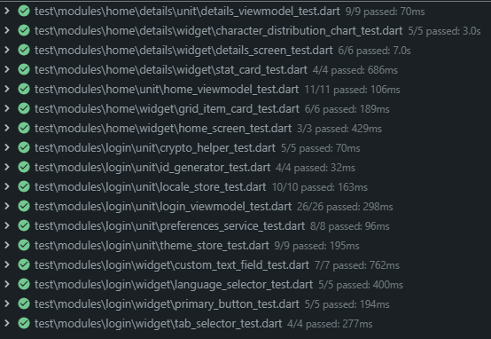

# Target App

[Português](#português) | [English](#english)

---

## Português

Aplicação Flutter com gerenciamento de grid dinâmico e estatísticas detalhadas.

### Como executar

#### Pré-requisitos
- Flutter SDK instalado (versão 3.0 ou superior)

#### Instalação de Dependências

```bash
flutter pub get
```

#### Executando no Emulador

1. **Listar dispositivos disponíveis:**
```bash
flutter devices
```

2. **Iniciar um emulador Android (se não houver nenhum rodando):**
```bash
flutter emulators
flutter emulators --launch <emulator_id>
```

3. **Executar o aplicativo:**
```bash
flutter run
```

#### Executando em Dispositivo Físico

1. **Android:**
   - Habilite o modo desenvolvedor no dispositivo
   - Ative a depuração USB
   - Conecte o dispositivo ao computador
   - Execute: `flutter run`

2. **iOS:**
   - Conecte o iPhone/iPad ao Mac
   - Confie no computador quando solicitado
   - Execute: `flutter run`

#### Executar em modo release

```bash
flutter run --release
```

#### Executar testes

```bash
# Todos os testes
flutter test

# Testes de um módulo específico
flutter test test/modules/home/
```



### Funcionalidades

- Autenticação de usuário (login/registro)
- Grid dinâmico com número de colunas configurável
- Edição de itens do grid
- Persistência local com Hive (offline-first)
- Página de estatísticas e detalhes
- Gráficos de distribuição de caracteres (barras e pizza)
- Suporte a internacionalização (PT/EN)

---

## English

Flutter application with dynamic grid management and detailed statistics.

### How to Run

#### Prerequisites
- Flutter SDK installed (version 3.0 or higher)

#### Install Dependencies

```bash
flutter pub get
```

#### Running on Emulator

1. **List available devices:**
```bash
flutter devices
```

2. **Start an Android emulator (if none is running):**
```bash
flutter emulators
flutter emulators --launch <emulator_id>
```

3. **Run the application:**
```bash
flutter run
```

#### Running on Physical Device

1. **Android:**
   - Enable developer mode on the device
   - Enable USB debugging
   - Connect the device to the computer
   - Run: `flutter run`

2. **iOS:**
   - Connect iPhone/iPad to Mac
   - Trust the computer when prompted
   - Run: `flutter run`

#### Run in release mode

```bash
flutter run --release
```

#### Run tests

```bash
# All tests
flutter test

# Tests for a specific module
flutter test test/modules/home/
```


### Features

- User authentication (login/register)
- Dynamic grid with configurable number of columns
- Grid item editing
- Local persistence with Hive (offline-first)
- Statistics and details page
- Character distribution charts (bar and pie)
- Internationalization support (PT/EN)
